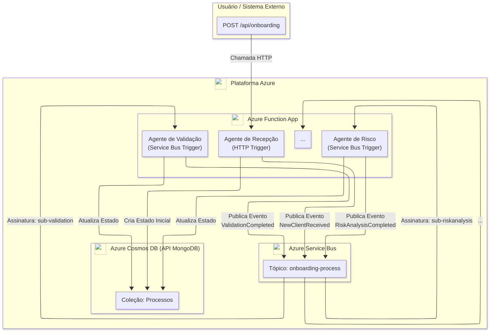

# Analista de Processos de Negócio Autônomo (BPA-AI)

[](/infra/main.bicep)
[](LICENSE)

Um projeto de plataforma serverless e event-driven no Azure que orquestra agentes de IA para automatizar processos de negócio complexos, como o onboarding de novos clientes. Este repositório serve como uma vitrine de arquitetura de nuvem e engenharia de IA, documentado passo a passo para aprendizado e replicação.

## O Problema a ser Resolvido

A maioria das aplicações de IA atuais opera em um paradigma de "Perguntas e Respostas". O usuário pergunta, a IA responde. Este projeto eleva esse paradigma para "Tarefas e Ações". Em vez de ser um oráculo passivo, o BPA-AI atua como um time de "operários digitais" autônomos que executam um workflow de negócio de ponta a ponta, tomando decisões e interagindo com outros sistemas.

## Diagrama da Arquitetura



## Stack de Tecnologia

| Categoria | Tecnologia |
| :--- | :--- |
| **Cloud** |  |
| **Computação** |  |
| **Mensageria** |  |
| **Banco de Dados** |  |
| **Inteligência Artificial** |  |
| **Infra as Code** |  |
| **Observabilidade** |  |


## Como Funciona: Workflow de Onboarding de Cliente

O sistema opera como uma máquina de estados distribuída, orquestrada por eventos, onde cada passo é executado por um agente especializado:

1.  **Recepção:** Uma requisição HTTP, contendo os dados iniciais de um cliente, inicia um novo processo de onboarding. O "Agente de Recepção" valida os dados, cria um documento de estado inicial no Cosmos DB e publica um evento `NewClientReceived` no tópico do Service Bus.

2.  **Validação e Enriquecimento:** O "Agente de Validação", que assina o evento `NewClientReceived`, é ativado. Ele consulta APIs externas (como a da Receita Federal) para enriquecer os dados do cliente e os valida contra as regras de negócio. Ao concluir, atualiza o estado no Cosmos DB e publica um novo evento, como `ValidationCompleted`.

3.  **Análise de Risco:** Um "Agente de Risco" reage ao evento de validação. Utilizando técnicas como RAG (Retrieval-Augmented Generation), ele analisa os dados enriquecidos contra uma base de conhecimento interna (políticas de crédito, histórico) para calcular um score de risco. O estado é novamente atualizado, e um evento `RiskAnalysisCompleted` é disparado.

4.  **Tomada de Decisão:** O "Agente de Decisão" aplica regras de negócio ao score de risco, decidindo por aprovar, rejeitar ou encaminhar o caso para revisão humana. Ele atualiza o estado com a decisão final e publica `DecisionMade`.

5.  **Comunicação:** Agentes finais, que assinam os eventos de decisão, são responsáveis por notificar os sistemas relevantes: enviar um e-mail de boas-vindas ao cliente, criar uma notificação no Slack para a equipe interna, etc., finalizando o workflow.

## Getting Started: Provisionando a Infraestrutura

Esta primeira fase consiste em provisionar toda a arquitetura necessária no Azure usando Infraestrutura como Código (IaC) com Bicep.

### Pré-requisitos

- Uma Assinatura do Azure.
- [Azure CLI](https://docs.microsoft.com/en-us/cli/azure/install-azure-cli) instalado e logado (`az login`).
- [VS Code](https://code.visualstudio.com/) com a extensão [Bicep](https://marketplace.visualstudio.com/items?itemName=ms-azure-tools.vscode-bicep).

### Passos para o Deploy

1.  **Clone o Repositório:**
    ```bash
    git clone https://github.com/SEU_USUARIO/bpa-ai.git
    cd bpa-ai
    ```

2.  **Crie um Grupo de Recursos no Azure:**
    Escolha um nome e uma localização para seu grupo de recursos. É recomendado usar uma região com ampla disponibilidade de serviços.
    ```bash
    # Exemplo usando a região Brazil South
    az group create --name "rg-bpa-ai-dev" --location "brazilsouth"
    ```

3.  **Execute o Deploy com Bicep:**
    Use o comando abaixo para implantar todos os recursos definidos no arquivo `/infra/main.bicep`. O processo é idempotente e pode levar alguns minutos.
    ```bash
    az deployment group create \
      --resource-group "rg-bpa-ai-dev" \
      --template-file ./infra/main.bicep
    ```

Ao final, você terá todos os componentes da arquitetura provisionados e prontos para a próxima fase: o desenvolvimento do código dos agentes.